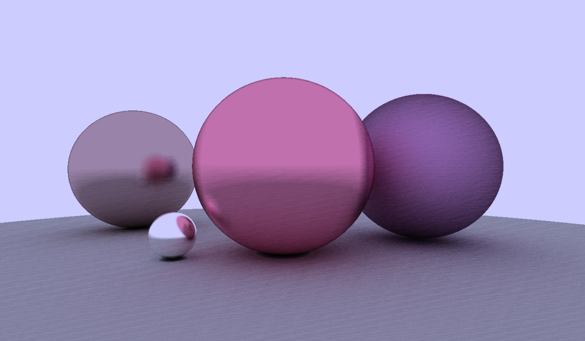
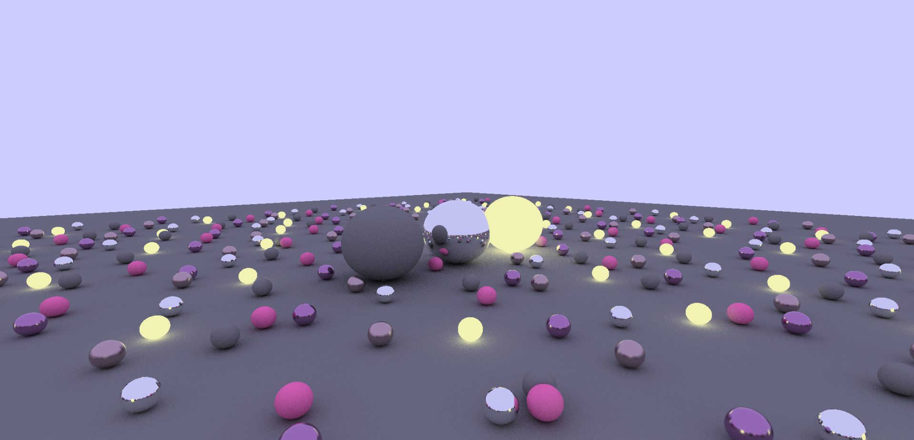
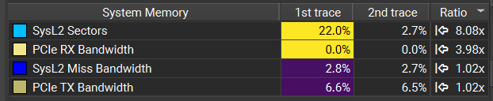
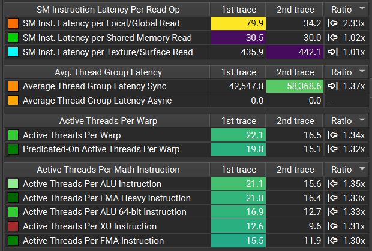
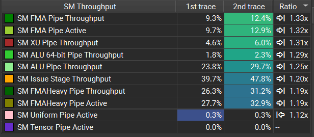

# RTOW: DirectX Implementation



## RTOW and Intro To DXR

This project aims to implement Ray Tracing in One Weekend using DirectX.

* [Ray Tracing in One Weekend (RTOW)](https://raytracing.github.io/books/RayTracingInOneWeekend.html) is a path tracer written C++ that runs on the CPU. I have implemented this tutorial in 2024, along with adding my own extensions (emissive materials and triangle geometry), which can be found [here](https://github.com/ccaitlingo/ray-tracing-extensions).

* Two years later, I learn about the GPU and want learn about path tracing using DirectX (DXR), one of the most common APIs for developing ray tracing programs that run on the GPU. [Intro To DXR](https://github.com/acmarrs/IntroToDXR) is a startup framework for it. (Specifically, "A barebones application to get you jump started with DirectX Raytracing! Unlike other tutorials, this sample code _does not create or use any abstractions_ on top of the DXR Host API, and focuses on highlighting exactly what is new and different with DXR using the raw API call.")

* This ray tracer demonstrates two intersection methods: built-in triangle intersection on NVIDIA hardware and custom sphere intersection by detecting AABB hits and then running shader code to calculate the intersection. Therefore, an intersection shader only exists for the sphere method. The closest hit shaders for both triangle and sphere methods implement diffuse, reflective, and emissive shading. **I implement the classic RTOW scene using both methods and compare them below.**

## *Analysis:* Triangle Intersection (Hardware) vs. Sphere Intersection (Software)



### Nsight Graphics Profiling Trace Compare

1st trace = Hardware Intersection, 2nd trace = Custom Intersection Shader (Software Intersection)

### Triangle Intersection
* Performed by the hardware (RT cores)
* Memory heavy
* Higher latency seen because of vertex/index memory reads from global memory




### Sphere Intersection
* Performed by custom intersection shader (`IntersectionSphere.hlsl`)
* Compute heavy
* Active SM



To recreate, run [Nsight Graphics GPU Trace Profiler](https://archive.docs.nvidia.com/nsight-graphics/2023.1/UserGuide/index.html#gpu_trace_ui) on `bin/IntroToDXR_model.exe` and `bin/IntroToDXR_sphere.exe`.

## Requirements

* Windows 10 v1809, "October 2018 Update" (RS5) or later
* Windows 10 SDK v1809 (10.0.17763.0) or later. [Download it here.](https://developer.microsoft.com/en-us/windows/downloads/sdk-archive) 
* Visual Studio 2017, 2019, or VS Code

## Instructions (Windows)
### Build
```
& 'C:\Program Files\Microsoft Visual Studio\18\Insiders\MSBuild\Current\Bin\MSBuild.exe' `    '.\IntroToDXR.sln' /m /p:Configuration=Release /p:Platform=x64
```
### Run
```
& ".\bin\IntroToDXR.exe" -width 1920 -height 1080
```

## Intro To DXR: _Suggested Exercises_

From Adam Marrs's Intro To DXR:

After building and running the code, first thing I recommend you do is load up the Nsight Graphics project file (IntroToDXR.nsight-gfxproj), and capture a frame of the application running. This will provide a clear view of exactly what is happening as the application is running. [You can download Nsight Graphics here](https://developer.nvidia.com/nsight-graphics).

Once you have a good understanding of how the application works, I encourage you to dig deeper into DXR by removing limitations of the current code and adding new rendering features. I suggest:

* [yes!] Add antialiasing by casting multiple rays per pixel.
* [yes!] Add loading and rendering of models with multiple materials (only a single material is supported now)
* [yes!] Add realistic lighting and shading (lighting is currently baked!)
* [todo: AnyHit] Add ray traced shadows. _Extra credit:_ use Any-Hit Shaders for shadow rendering
* Add ray traced ambient occlusion.
* [yes!] Add ray traced reflections for mirror-like materials.
* Add camera translation and rotation mapped to keyboard and mouse inputs.
* [yes! mostly.] Implement [Ray Tracing In One Weekend](https://www.amazon.com/Ray-Tracing-Weekend-Minibooks-Book-ebook/dp/B01B5AODD8/ref=sr_1_1?ie=UTF8&qid=1540494705&sr=8-1&keywords=ray+tracing+in+one+weekend)

## Licenses and Open Source Software
The code uses two dependencies:
* [TinyObjLoader](https://github.com/syoyo/tinyobjloader-c/blob/master/README.md), provided with an MIT license. 
* [stb_image.h](https://github.com/nothings/stb/blob/master/stb_image.h), provided with an MIT license.

The repository includes assets for use when testing the renderer:
* [Statue Image](https://pixabay.com/en/statue-sculpture-figure-1275469/), by Michael Gaida, licensed under a [CC0 1.0 Creative Commons Universal Public Domain Dedication License](https://creativecommons.org/publicdomain/zero/1.0/deed.en). 
* [Peerless Magnarc Cinema Projectors](https://sketchfab.com/models/62046af7d4f84b4ebe01d44f54970bc1), by Miguel Bandera, licensed under a [Creative Commons Attribution 4.0 International License](https://creativecommons.org/licenses/by/4.0/). 

